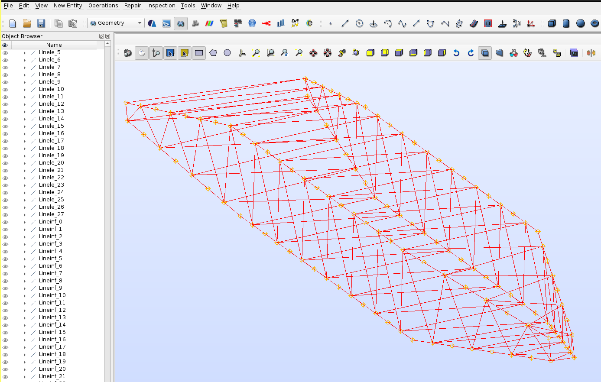
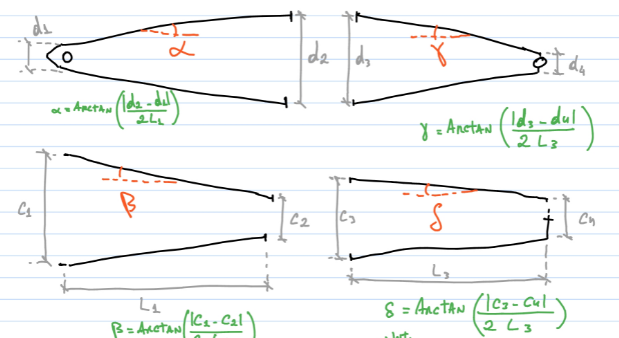

### Creates a crane boom model based on parameterized measures.

#### How to use:
Provide values for `d1`, `d2`, `d3`, `d4`, `c1`, `c2`, `c3`, `c4`, `L1`, `L2`, `L3`, `n_pe`, `n_in` and `n_po` variables in the `script.py` file, and then run it.

The result will be a file called `script_salome.py`, wich can be loaded in Salome Meca to create the model.

